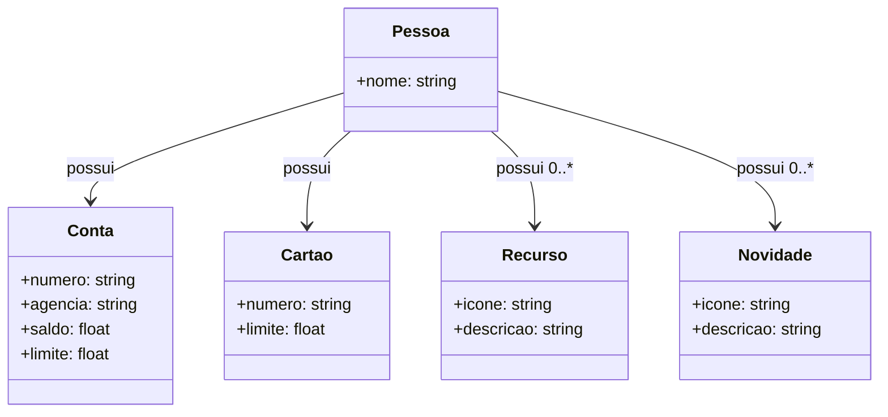

# santander-bootcamp-java-backend-2023
Java Restful criada para finalizar o bootcamp da Santander Bootcamp Java Backend 2023

## Diagrama de classes

```mermaid
classDiagram
    class Pessoa {
        +nome: string
    }

    class Conta {
        +numero: string
        +agencia: string
        +saldo: float
        +limite: float
    }

    class Cartao {
        +numero: string
        +limite: float
    }

    class Recurso {
        +icone: string
        +descricao: string
    }

    class Novidade {
        +icone: string
        +descricao: string
    }

    Pessoa --> Conta : possui
    Pessoa --> Cartao : possui
    Pessoa --> Recurso : possui 0..*
    Pessoa --> Novidade : possui 0..*
```
